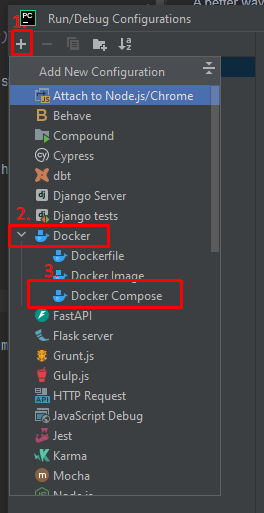
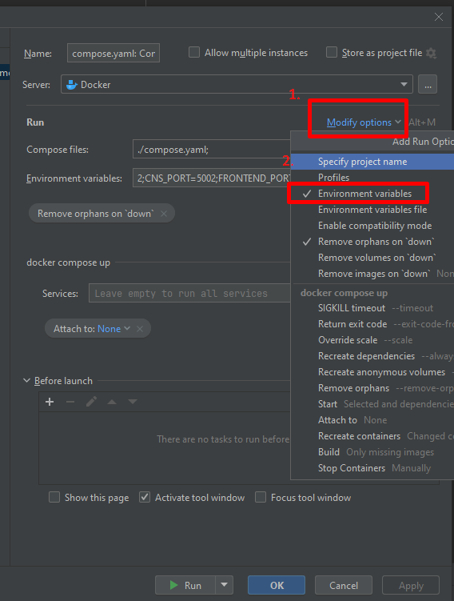
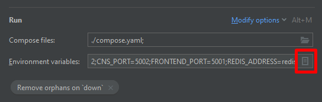
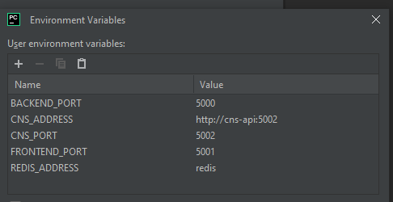

# TimetableSync

A better way to view your timetable, with the ability to integrate with 3<sup>rd</sup> party services such as Google Calendar, Apple Calendar and Outlook.


## Setting up the environment variables for DOCKER (without the bot): 
### Fore note:
I was using pycharm so this will be directed mostly at pycharm users, but you will need to set the same environment variables no matter what you use.

### Instructions:

Go to the <span style="color:red;"> compose.yaml </span> file, on the top right, beside the green run button, press on the grey drop down button, press on edit configurations.


Now it is time to add a docker configuration; in the ui that popped out, on the top left of it, there should be a `+`, press it and a dropdown should show you of possible configurations, add a docker compose.



In the Docker configuration, you should see a "run" section, press modify options and add "Environment variables".



Then you can press this:




Add the following variables with ports to your liking: (Do not change redis and cns.)

Example Setup:
```
BACKEND_PORT    5000
CNS_ADDRESS     http://cns-api:5002
CNS_PORT        5002
FRONTEND_PORT   5001
REDIS_ADDRESS   redis
```

It should look something like this:




After adding these environmental variables, make sure to press Apply and then run.
Then you can press the green triangle at the top right to start the docker whenever you need to.

If you need more information, [pycharm has a document on the docker extension](https://www.jetbrains.com/help/pycharm/docker-image-run-configuration.html).

## How do I use this?
Make sure that your docker is running without errors. (You can ignore "bot" and "postgres")
Now, you can go into your browser and write localhost and local timetable sync will open.

Some useful pages from this are:

localhost

localhost/doc

localhost/generator